[](https://classroom.github.com/a/6Ej9jvLk)
# wxWidgets Hex Editor

Create a minimalistic hex editor using wx widgets.
You may follow the wireframe below when designing your GUI.



At the very least, it must be possible to enter text in either of the input
fields. The text must immediately appear in both fields - once as regular
ASCII text and once as hex representation of the text.
In the hex field, you may only enter hex characters while the text field
must allow all ASCII characters. (65 points)

You'll receive 5 bonus points for each of the following controls for
* creating a new file (simply replacing the current content)
* opening a file that is stored on disk
* saving the current file to disk

These controls can be made available either as menu items, in a toolbar or
as regular buttons.

You have to provide either a `CMakeLists.txt` or a `Makefile` that builds
your program. The program must build without errors in Linux. (10 points)

Edit this [README](README.md) with instructions on how to compile your program.
(5 points)

Provide a `LICENSE` file that correctly contains any open source license and
your name. (10 points)

Push your work to make it available for grading. (10 points)

---
## How to compile:
If you want use make, just go in this directory and hit:
```shell
  make
```


Or if u want use gcc:
```shell 
gcc -std=c++11 -Wall `wx-config --cxxflags` -include wx_pch.h wx_HexEditorApp.cpp wx_HexEditorMain.cpp -o wx_HexEditor `wx-config --libs` -lstdc++
```


## How to start it:
```shell
  ./wx_HexEditor
```


## How to use my HexEditor

Just write your ASCII in the first Input. 


äöü are not allowed! Just the first 127 ASCII Chars


In HEX you can write with or without Space or just mixed if you want. 

But there is just HEX allowed: 


# wxHexEditor
